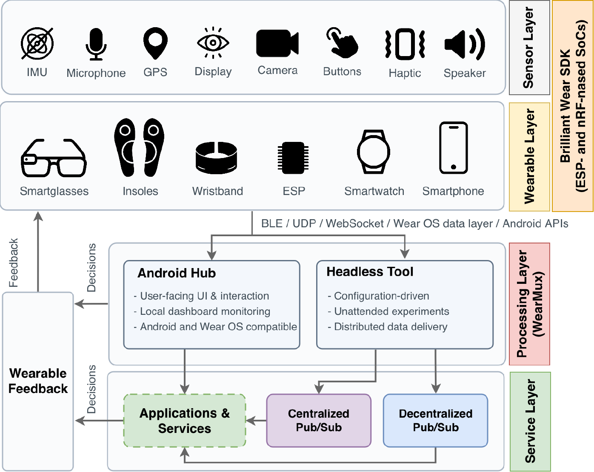

# WearMux — Android Hub

WearMux brings smartglasses, wristbands, smartwatches, and smartphone sensors together in one Android application. It collects images, audio, motion, and location data, runs selected processing on the phone or a remote server, and delivers feedback through audio, vibration, and wearable notifications.

This repository contains the Android hub and its Wear OS companion, developed for research into multimodal sensing and interactive wearable applications. The [headless research tool](https://github.com/nap-it/wearmux-headless) is maintained separately.

## Key Features

- **Multiple wearables, one hub:** connect compatible devices through Bluetooth Low Energy, Wi-Fi/UDP, and the Wear OS Data Layer.
- **Multimodal acquisition:** combine camera, microphone, inertial, heart-rate, and location data from wearables and the phone.
- **Flexible processing:** run supported activity, vision, and audio processing locally or use optional remote services; compatible wristbands also support on-device activity inference.
- **Wearable feedback:** deliver audio alerts, vibration, and watch notifications through connected devices.
- **Live monitoring and recording:** inspect incoming streams, record routes, and capture measurements for experiments.
- **Application integration:** share observations through HTTP, WebSocket, and optional MQTT connections, with a common hub timestamp.

## Citation

If you use WearMux in your research, please consider citing *WearMux: Real-Time Multimodal Sensing and Feedback across Heterogeneous Wearables*.

```bibtex
@unpublished{Tavares2026WearMux,
    author = {Tavares, Guilherme and Soares, Rafael and Clérigo, André and Silva, Gonçalo and Silva, Gabriel and Cruz, Tomás and Abrunhosa, João and Laredo, Pedro and Rito, Pedro and Sargento, Susana},
    title = {{WearMux}: Real-Time Multimodal Sensing and Feedback across Heterogeneous Wearables},
    year = {2026},
    note = {WPMC 2026 manuscript}
}
```

## Table of Contents

- [WearMux — Android Hub](#wearmux--android-hub)
  - [Key Features](#key-features)
  - [Citation](#citation)
  - [Table of Contents](#table-of-contents)
  - [How It Works](#how-it-works)
  - [Supported Devices](#supported-devices)
  - [Requirements](#requirements)
  - [Quick Start](#quick-start)
  - [Basic Usage](#basic-usage)
  - [Documentation and Demonstration](#documentation-and-demonstration)
  - [Authors and Contact](#authors-and-contact)
  - [License](#license)

## How It Works

The phone acts as the hub between wearable devices and applications. Device adapters expose sensing and feedback capabilities, so the acquisition and processing modules can work with different sources: an image can come from glasses or the phone, while motion can come from a wristband, watch, or phone.

Collected observations can be consumed locally or sent to external services. Results can then trigger feedback on the phone or connected wearables. A foreground service manages connections and acquisition during use.



*Figure 1 from the WearMux manuscript. The overview includes both hosts; this repository implements the Android path.*

## Supported Devices

| Device | Connection | Main capabilities |
| --- | --- | --- |
| Omi AI glasses | BLE; Wi-Fi/UDP for camera streaming | Camera, microphone, inertial sensing |
| Brilliant Wear / Brilliant Sole wristband and insole | BLE | Inertial sensing, haptics, on-device activity inference |
| Galaxy Watch / Wear OS companion | Wear OS Data Layer | Inertial sensing, heart rate, notifications, vibration |
| ESP32-S3 camera board | Wi-Fi/UDP | Camera, inertial sensing |
| Android smartphone | Local Android APIs | Camera, microphone, inertial sensing, GPS, audio feedback |

Available capabilities depend on the device hardware and compatible firmware. The Android and headless hosts have different device coverage.

## Requirements

- Android Studio, Android SDK 36, and JDK 17 or newer.
- An Android 14 (API 34) or newer phone with Bluetooth Low Energy and an `arm64-v8a` processor.
- For watch features: a paired Wear OS device with API 34 or newer, compatible with the companion's `armeabi-v7a` build.
- For remote processing: a compatible WearMux server reachable from the phone. Local operation does not require a server.

A Navisens developer key is optional and enables the trajectory view. Model setup and other optional components are described in the [technical guide](docs/technical-guide.md#local-configuration).

## Quick Start

1. Clone the repository and open it in Android Studio:

   ```bash
   git clone https://github.com/nap-it/wearmux-android.git
   cd wearmux-android
   ```

2. Let Android Studio configure the SDK location and sync the project. Build the phone app:

   ```bash
   ./gradlew :app:assembleDebug
   ```

3. Connect an Android phone with USB debugging enabled and install the app:

   ```bash
   ./gradlew :app:installDebug
   ```

4. If you use a watch, build and install the companion on the paired watch:

   ```bash
   ./gradlew :wear:assembleDebug
   ./gradlew :wear:installDebug
   ```

   If multiple devices are connected, use `adb -s <device-serial> install -r <apk-path>` to choose the installation target. See the [build instructions](docs/technical-guide.md#build) for APK paths.

## Basic Usage

1. Launch the phone app and grant the permissions requested for the features you use, including nearby devices, location, camera, microphone, and notifications.
2. Select **Search Wearables** on the home screen, scan for compatible devices, and connect a wearable. For the watch, install the companion and pair it with the phone first.
3. Open the connected device's details or status view to inspect streams and configure sensing. Omi glasses connect over BLE first and can switch camera streaming to Wi-Fi/UDP.
4. Use **Settings** to choose supported processing options and set alert preferences. Glasses object detection defaults to the bundled local model. For remote services, enable **Developer mode** in Settings and configure your server URL; the compiled server address belongs to the development setup.
5. Monitor incoming data and feedback, or record a route for an experiment.

## Documentation and Demonstration

Download versioned phone and Wear OS APKs from [GitHub Releases](https://github.com/nap-it/wearmux-android/releases), when published.

For development builds, the [GitHub Build APKs workflow](.github/workflows/build-apks.yml) and [GitLab pipeline](.gitlab-ci.yml) build debug APKs on all branches when app code, models, or build configuration changes. Documentation-only pushes skip the build. Both platforms include the branch and commit in APK filenames, for example `wearmux-phone-debug-main-a1b2c3d.apk` and `wearmux-wear-debug-main-a1b2c3d.apk`. Download them from a completed GitHub run's **Artifacts** section or the GitLab job's artifacts.

Version tags build signed APKs on GitHub and prepare a draft research prerelease with checksums. The draft can be tested and reviewed before publication. See the [build and release instructions](docs/technical-guide.md#continuous-integration-and-releases).

The [technical guide](docs/technical-guide.md) covers configuration, internal architecture, command-line control, server endpoints, MQTT, benchmarks, tests, and troubleshooting.

The paper demonstrates the Android hub in outdoor pedestrian-assistance scenarios using smartglasses, a smartwatch, and a phone. Watch the [WearMux demonstration](https://youtu.be/r0GW5SRqzHw).

For unattended acquisition and distributed research workflows, see [WearMux Headless](https://github.com/nap-it/wearmux-headless).

## Authors and Contact

Development of WearMux Android is part of ongoing research work at [Instituto de Telecomunicações' Network Architectures and Protocols Group](https://www.it.pt/Groups/Index/36).

Questions and bug reports: [andreclerigo@ua.pt](mailto:andreclerigo@ua.pt) / [gavftavares@ua.pt](mailto:gavftavares@ua.pt) / [rafael.feliciano@ua.pt](mailto:rafael.feliciano@ua.pt)

## License

WearMux Android is licensed under the **GNU General Public License v3.0 (GPL-3.0)**. See [LICENSE](LICENSE) for the full terms.
