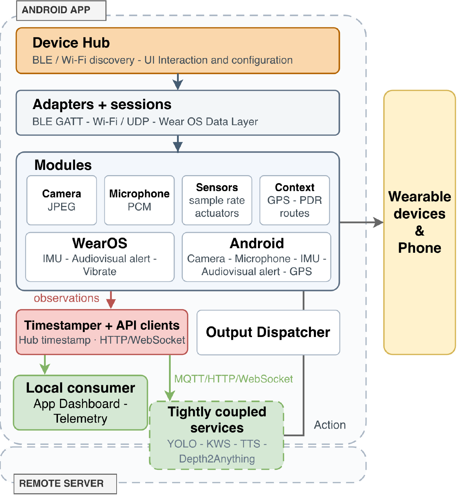

# WearMux Android technical guide

For an overview, setup instructions, citation, and contacts, see the [project README](../README.md).



*Android hub architecture, reproduced from Figure 3 of the WearMux manuscript supplied with this project.*

## Repository contents

```text
.
├── app/                    # Android smartphone hub application
│   └── src/
│       ├── main/           # Kotlin/Compose app and integration layer
│       ├── test/           # JVM unit tests
│       └── androidTest/    # Android instrumentation tests
├── wear/                   # Wear OS companion application
├── models/                 # TFLite models copied into the app assets at build time
├── scripts/                # Helper scripts (YAMNet download, watch test)
├── gradle/                 # Gradle version catalog and wrapper
├── build.gradle.kts
├── settings.gradle.kts
└── gradlew
```

The integration layer under `app/src/main/java/com/example/peciwearables/integration/` follows the architecture figure in the paper, one package per block:

```text
integration/
├── hub/          Device hub: discovery, adapter selection, session ownership
├── adapters/     Adapters and sessions, including the per-device BLE clients
│   └── devices/  omi, brilliantsole, esp32, galaxywatch
├── modules/      Modality processing
│   ├── camera/       JPEG assembly, stream metrics, phone and glasses frames
│   ├── microphone/   PCM pipeline, Opus decoding, WAV capture, and KWS sessions
│   ├── sensors/      IMU fusion, sample-rate policy
│   ├── context/      GPS, pedestrian dead reckoning, route recording
│   ├── android/      Phone camera, microphone, sensors, audio output
│   └── wearos/       Watch client, protocol and action routing
├── observation/  Timestamper: the hub timestamp carried by every observation
├── api/          HTTP, WebSocket and MQTT clients for the remote services
├── output/       Output dispatcher: alerts to the watch, wristband and phone
├── consumer/     Local consumer: telemetry reporting
├── safety/       Use-case logic and decision mapping
├── protocol/     Wire formats (packet headers, TLV, IMU payloads)
├── udp/          UDP session handling for the Wi-Fi image path
└── network/      NSD registration, Wi-Fi locks, interface helpers
```

## Supported devices

| Device | Transport | Capabilities exposed to the hub |
| --- | --- | --- |
| Omi AI glasses (ESP-based) | BLE GATT, Wi-Fi/UDP | Camera, microphone, 9-DoF IMU, Wi-Fi handoff |
| Brilliant Wear wristband/insole | BLE GATT | 9-DoF IMU, haptics, on-device ML |
| Wear OS watch | Wear OS Data Layer | IMU, heart rate, audiovisual alerts, vibration |
| ESP32-S3 camera board | Wi-Fi/UDP | Camera, IMU |
| The phone itself | Local Android APIs | Camera, microphone, IMU, GPS, audio alerts |

Adding a device means writing an adapter and a session under `integration/adapters/devices/`. Nothing above the adapter layer refers to a device by brand; the UI and the pipelines reason about capabilities.

## Requirements

- Android Studio with Android SDK 36 installed
- JDK 17 or newer (the build has been exercised with JDK 17; Gradle 9.1 ships with the wrapper)
- Phone running Android 14 (API 34) or newer, `arm64-v8a`
- Wear OS device running API 34 or newer for the companion module, `armeabi-v7a`
- A machine running the WearMux server repository if you intend to use offloaded inference

Bluetooth Low Energy is required. The camera is optional at the manifest level, so the app installs on devices without one.

## Local configuration

### SDK location

Gradle reads the SDK path from `local.properties`, which is not tracked. Android Studio writes it on first open; to create it by hand:

```properties
sdk.dir=/path/to/Android/Sdk
```

### Navisens developer key

The trajectory view is backed by Navisens and needs a developer key. The key is not stored in the repository; it is injected into the `navisens_developer_key` string resource at build time. Supply it through **one** of the following:

1. Add this line to the untracked `local.properties` file:

```properties
NAVISENS_DEVELOPER_KEY=your_key_here
```

2. Export an environment variable before building:

```bash
export NAVISENS_DEVELOPER_KEY=your_key_here
```

3. Pass a Gradle property:

```bash
./gradlew :app:assembleDebug -PNAVISENS_DEVELOPER_KEY=your_key_here
```

If no key is supplied the generated string is empty and the trajectory view stays inactive; every other feature builds and runs normally.

### Server address

The compiled default is `http://172.20.10.2:8080`, defined in `integration/CloudConfig.kt`, with the Sherpa keyword spotter on port 9091. This is a development-network address, not a public WearMux service. You do not need to rebuild to change it: open **Settings**, enable **Developer mode**, and set the unified server URL. The value is stored in shared preferences and reused on the next start. Glasses object detection defaults to the bundled local YOLO model; remote voice commands and other server features still require a configured, reachable service.

### Wearable Wi-Fi credentials

The glasses join the same network as the phone. The Wi-Fi dialog on the glasses device screen asks only for the password; nothing is stored in the repository.

### TFLite models

`app/build.gradle.kts` copies the models from `models/` into `app/src/main/assets` before every build. The phone classifier becomes `peci_model.tflite` and the wristband model becomes `trained.tflite`. YAMNet, used for ambient sound classification, is optional and can be fetched with `scripts/download_yamnet.sh`; without it that path falls back to an RMS heuristic.

### Audio commands and recordings

The Android hub captures microphone audio and exposes it to configured remote services. Voice commands use the Sherpa keyword-spotting service; recognized keyword events are forwarded to the WearMux server at `/inputs/audio_stt` over HTTP or optional MQTT. Local microphone recordings can also be saved for later use by external tools. Spoken feedback uses Android's `TextToSpeech` engine.

## Build

From the repository root:

```bash
# Build the Android phone app
./gradlew :app:assembleDebug

# Run JVM unit tests
./gradlew :app:testDebugUnitTest

# Build the Wear OS companion
./gradlew :wear:assembleDebug
```

Installation on connected devices:

```bash
./gradlew :app:installDebug
./gradlew :wear:installDebug
```

When both a phone and a watch are attached, pass the serial to disambiguate:

```bash
adb -s <serial> install -r app/build/outputs/apk/debug/app-debug.apk
```

### Continuous integration and releases

GitHub Actions and GitLab CI build the phone and Wear OS debug APKs for all branches when source code, models, build configuration, or CI scripts change. Documentation-only pushes skip compilation. A manual GitHub workflow run or GitLab **Run pipeline** builds the selected ref regardless of its changes.

APK filenames include the branch and the first seven characters of the commit, for example `wearmux-phone-debug-main-a1b2c3d.apk`. The app's installed name and package ID stay the same. GitHub stores separate phone and watch artifact downloads; GitLab stores both APKs and `SHA256SUMS` in the `debug-apks` job's artifacts. Artifacts are retained for 30 days. The Git mirror copies source and tags; each platform builds and stores its own APKs.

GitLab supports Linux x86_64 shell, Docker, and Kubernetes runners with **glibc 2.17 or newer**. The setup script reports and checks the host's glibc version, installs checksum-verified Temurin JDK 21 and Android SDK 36 under the job workspace, and caches them; no root access, `sudo`, or package installation is required during the job. Temurin runs on older glibc hosts than the JetBrains runtime used previously. Gradle requires Java 21 without a vendor restriction, so it uses the provided Temurin JDK instead of downloading JetBrains again. The new JDK cache directory is separate from the old one; no manual cache clearing is required.

Shell runners ignore the YAML `image` setting and use their host's Bash, Git, `tar`, `sha256sum`, `getconf`, and either `curl` or `wget`. The SDK archive is extracted with the downloaded JDK, so system Java and `unzip` are not required. The runner needs network access to GitHub, Google, and Gradle/Maven dependency repositories. Docker/Kubernetes runners also need access to the configured container image. A host older than glibc 2.17 needs a newer runner or a container executor; changing `image:` does not change the environment of a shell executor.

Enable an available runner that accepts untagged jobs under **Settings → CI/CD → Runners**. If any basic utility is missing on a Debian/Ubuntu shell host, an administrator can install it once on that host:

```bash
sudo apt-get update
sudo apt-get install -y bash git curl tar coreutils ca-certificates
```

These commands are host setup, not pipeline steps. Debug builds need no signing secrets. `NAVISENS_DEVELOPER_KEY` can optionally be added under **Settings → CI/CD → Variables** to enable trajectory features in GitLab builds. GitHub secrets are not copied to GitLab by mirroring.

The GitHub **Release APKs** workflow builds signed APKs, runs JVM tests, verifies matching phone/watch signatures and versions, and creates a draft research prerelease. Configure these GitHub repository secrets once:

- `WEARMUX_KEYSTORE_BASE64`
- `WEARMUX_KEYSTORE_PASSWORD`
- `WEARMUX_KEY_ALIAS`
- `WEARMUX_KEY_PASSWORD`
- Optionally, `NAVISENS_DEVELOPER_KEY`

Keep a backup of the release keystore and reuse it for later releases so installed apps can update. GitLab's tag pipeline produces debug artifacts; the signed distribution APKs come from the GitHub release workflow.

For the first release, the shared values in `gradle.properties` are already `wearmux.versionName=1.0.0` and `wearmux.versionCode=1`. Commit the release changes on `main`, push them to GitLab, then create and push the matching tag:

```bash
git switch main
git pull --ff-only origin main
git tag -a v1.0.0 -m "WearMux Android initial research release"
git push origin v1.0.0
```

Wait for the tag to appear on the GitHub mirror. If it does not automatically start the release workflow, dispatch it explicitly:

```bash
gh workflow run release-apks.yml \
  --repo nap-it/wearmux-android --ref main -f tag=v1.0.0
```

Tag pushes and manual runs default to a draft prerelease. To prepare a stable draft on a later manual run, pass `-f prerelease=false`. For each subsequent published version, increase `wearmux.versionCode` and update `wearmux.versionName` before creating the matching tag. A published release's APKs cannot be replaced by rerunning the workflow.

Before publishing the draft, download its signed APKs and verify:

1. A fresh phone installation launches and handles the requested permissions.
2. A compatible wearable connects, streams data, and reconnects after disconnection.
3. Local glasses detection works without a remote server; configured server features work with your server.
4. The signed companion communicates with the phone and receives vibration/notification feedback on the paired watch.
5. Recording and playback work for the features you plan to demonstrate.

Installing a signed release over a debug installation may require uninstalling the debug app first, which removes its local data. Once testing passes, review the generated description under GitHub **Releases** and publish the draft. Keep the prerelease designation while the release is being evaluated.

## Running the application

### First start

On first launch, grant the permissions the app requests for the features you plan to use, including nearby devices, location, camera, microphone, notifications, and activity recognition. The app requests Bluetooth scan/connect and location permissions during setup; camera, microphone, and sensor features also require their respective permissions.

The app runs its work inside a foreground service, so acquisition survives the screen turning off. A persistent notification indicates that the service is active.

### Screens

- **Home** — select **Search Wearables** to scan for compatible devices, then open a connected-device card for details and controls. The device screens show connection state, battery, firmware, and signal strength, and provide Wi-Fi handoff and camera/microphone profiles.
- **Device status views** — live views of what the hub is receiving: camera preview, IMU streams, GPS and dead-reckoning position, watch state, safety decisions and the event log.
- **Dev Lab** — hidden unless developer mode is enabled in Settings. Raw logs, latency benchmarks, UDP diagnostics and per-use-case toggles.
- **Settings** — server URL, processing location, alert preferences and developer mode.

### Connecting a wearable

1. Select **Search Wearables** on the home screen and start a scan.
2. Pick a candidate from the list, or use automatic connection to take the first compatible device.
3. The hub reads the advertising data to choose a likely adapter, connects, and only confirms the match after reading the services the device actually exposes. A confirmed connection produces a session that advertises its capabilities.
4. For the glasses over Wi-Fi, connect over BLE first, then use the Wi-Fi dialog. The device joins the phone network and reports its address back over BLE; the image stream then moves to UDP.

For the ESP32 camera board, first join its `ESP32-CAM` Wi-Fi network from the phone.

The Wear OS companion needs no scanning. Install it and pair the watch with the phone; the phone and watch then find each other through the Data Layer. Galaxy Watch pairing uses Galaxy Wearable.

### Choosing where inference runs

Activity classification can run in three places, selected in Settings:

- **Phone** — TFLite model on the handset
- **Wristband** — model uploaded to the wearable, inference on-device, result delivered over BLE
- **Server** — features posted to the configured endpoint

Object detection and depth estimation are selected per mode in the camera view: local ONNX inference on the phone, or the remote services when the server URL is set.

Changing the processing location also changes the sensor sample rate the hub asks the wearable for. On-device inference needs 10 ms; when the camera or microphone is competing for the radio the rate drops to 200 ms; otherwise it is 50 ms.

### Recording routes

Open a connected phone/device status view, then start a route recording to capture a trajectory from GPS and dead reckoning. Routes are saved on the device, can be reactivated later, and are used by the crossing-zone logic.

### Benchmarks

Latency runs write CSV files to the app external files directory:

```bash
adb shell ls /sdcard/Android/data/com.example.peciwearables/files/benchmarks
adb pull /sdcard/Android/data/com.example.peciwearables/files/benchmarks .
```

One file per path: `yolo_latency.csv`, `depth_latency.csv`, `kws_latency.csv`, `decisions_latency.csv` and the camera and microphone transport measurements. Every row carries the hub timestamp, so rows from different sources can be aligned.

## Driving the app from the command line

The service accepts broadcasts, which is the practical way to script a measurement session without touching the screen. The receiver forwards them to the service unchanged.

```bash
# Start and stop the foreground service
adb shell am broadcast -a com.example.peciwearables.START_SERVICE
adb shell am broadcast -a com.example.peciwearables.STOP_SERVICE

# Connect devices
adb shell am broadcast -a com.example.peciwearables.CONNECT_GLASSES
adb shell am broadcast -a com.example.peciwearables.CONNECT_WRISTBAND
adb shell am broadcast -a com.example.peciwearables.CONNECT_AUTO

# Camera and microphone
adb shell am broadcast -a com.example.peciwearables.TAKE_PICTURE
adb shell am broadcast -a com.example.peciwearables.START_STREAM
adb shell am broadcast -a com.example.peciwearables.STOP_STREAM
adb shell am broadcast -a com.example.peciwearables.START_MICROPHONE

# Move the glasses to Wi-Fi, then open the UDP session on the address they report
adb shell am broadcast -a com.example.peciwearables.SEND_WIFI --es ssid MyNetwork --es password secret
adb shell am broadcast -a com.example.peciwearables.CONNECT_UDP

# Select where activity inference runs: APP, WRISTBAND or SERVER
adb shell am broadcast -a com.example.peciwearables.SET_ML_PROCESSING_LOCATION \
  --es ml_processing_location WRISTBAND

# Point the hub at a server without opening Settings
adb shell am broadcast -a com.example.peciwearables.UNIFIED_SERVER_SET_URL \
  --es unified_server_url http://192.168.1.50:8080
```

`CONNECT_UDP` takes no address: the glasses report theirs over BLE after the Wi-Fi handoff, and the hub uses that. The full list of actions and extras is in `integration/WearableServiceActions.kt`.

## Watching the logs

```bash
adb logcat -s WearableService:D SafetyLog:D CloudInference:D SherpaKwsClient:D
```

Lines prefixed with `BENCH|` carry the latency measurements that also reach the CSV files.

## Talking to the server

The hub expects the WearMux server on the address configured in Settings:

| Purpose | Endpoint |
| --- | --- |
| Object detection | `POST {base}/detect` |
| Depth estimation | `POST {base}/depth` |
| Scene description | `POST {base}/inputs/visual_assistant` |
| Keyword events | `POST {base}/inputs/audio_stt` |
| Head pose | `POST {base}/inputs/glasses_pose` |
| Telemetry and returned decisions | `POST {base}/telemetry` |
| Keyword spotting stream | `ws://{host}:9091` |

Every request carries `hub_timestamp`, stamped when the observation left acquisition rather than when the request was built. The server never replaces it; that value is what lets the fusion engine correlate motion, vision and speech coming from different devices.

### Publishing over MQTT

Besides the HTTP and WebSocket paths above, the hub can publish its outgoing observations to an MQTT broker. This is a second transport for the same payloads, not a replacement: the HTTP path keeps working regardless, and a broker that is unreachable never blocks or breaks it.

It is off until a broker is configured. Under Settings, enable **Publish observations over MQTT** and fill in the broker and the topic prefix, or do it from a terminal:

```bash
adb shell am broadcast -a com.example.peciwearables.MQTT_SET_CONFIG \
  --es mqtt_broker_url tcp://192.168.1.50:1883 \
  --es mqtt_topic_prefix wearmux \
  --ez mqtt_enabled true
```

The broker may be given as `host`, `host:port` or a full URL; the scheme defaults to `tcp://` and the port to 1883. Settings persist across restarts.

One topic per modality, named after the equivalent HTTP route:

| Topic | Payload |
| --- | --- |
| `<prefix>/telemetry` | Position, motion state, device state, zones |
| `<prefix>/inputs/audio_stt` | Keyword events |
| `<prefix>/inputs/glasses_pose` | Head orientation |

The payload published on a topic is byte-for-byte the JSON body sent to the matching HTTP route, `hub_timestamp` included. Requests that need an answer, such as object detection and depth estimation, stay on HTTP; MQTT carries only the one-way observation flow.

Checking what is being published, with a broker running on the same host:

```bash
mosquitto_sub -h 192.168.1.50 -t 'wearmux/#' -v
```

The phone is a client, not a broker. The broker is a separate program that normally runs on the server machine, which is the side of the link the architecture figure puts it on; this repository does not ship one. Any MQTT 3.1.1 broker works and Mosquitto is the usual choice. On the server side, `mqtt_bridge.py` in the server repository subscribes to these topics and feeds them to the same routes the HTTP path uses, so enabling MQTT does not change what the server does with an observation.

Publishing uses QoS 0, which suits observations that are only useful while they are recent. The connection is plain `tcp://` with no credentials: it is meant for a lab network, and a deployment outside one needs authentication and TLS added on both sides.

## Wear OS companion

The `wear` module streams wrist IMU to the phone and renders alerts. It holds the alert activity, vibration patterns, beeps, the notifier, the phone command listener and the state mirror that keeps the watch face in sync with the hub. Commands and acknowledgements travel over the Data Layer using the shared protocol in `WatchProtocol.kt`.

## Tests

```bash
./gradlew :app:testDebugUnitTest
```

The JVM suite covers the protocol parsers, the camera and audio pipelines, the adapter registry and session lifecycle, the safety evaluators, the sample-rate policy and the hub timestamp contract. Instrumentation tests under `app/src/androidTest` need a connected device:

```bash
./gradlew :app:connectedDebugAndroidTest
```

## Troubleshooting

**Scanning finds nothing.** Location permission must be granted and location services switched on; Android blocks BLE results otherwise. Check that the wearable is not already connected to another phone.

**The glasses connect but no images arrive.** Confirm the camera profile on the glasses device screen. Over BLE the throughput limits the frame rate; if you need a higher rate, move the device to Wi-Fi and let the UDP session take over.

**The Wi-Fi session drops and does not come back.** The hub runs a watchdog that reconnects and falls back to BLE. Watch `WearableService` logs for `UDP DBG` lines. Keeping the phone screen on during long captures avoids Wi-Fi power-saving behaviour on some handsets.

**Cloud features do nothing.** Check the server URL in Settings, and that the phone and server are on the same network. `GET {base}/health` from the phone browser is the quickest confirmation.

**The watch does not appear.** Both apps must be installed and the watch paired to the same phone. The companion is a separate APK; installing the phone app alone is not enough.

**Audio commands do nothing.** Check the server URL in Settings, confirm that the Sherpa keyword-spotting service is reachable on port 9091, and verify the server's `/inputs/audio_stt` endpoint. The Android app forwards audio and keyword results; external tools can consume saved recordings or server-side data.
